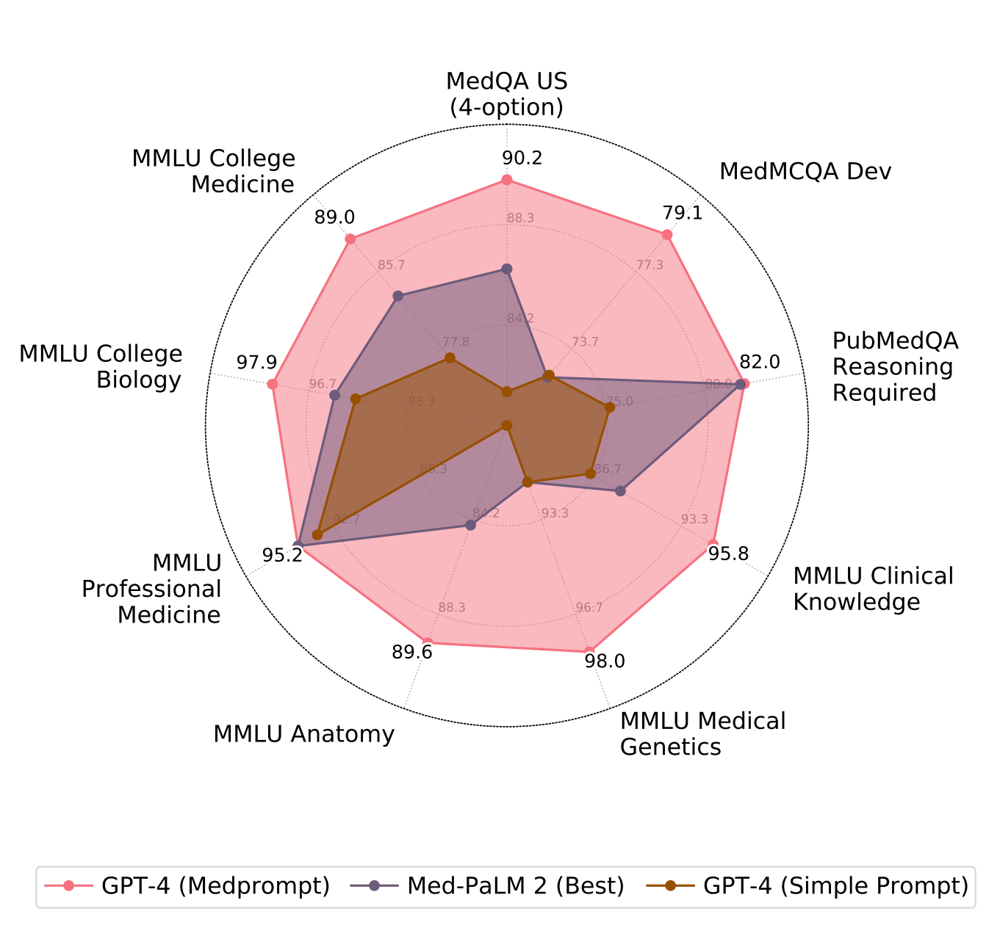
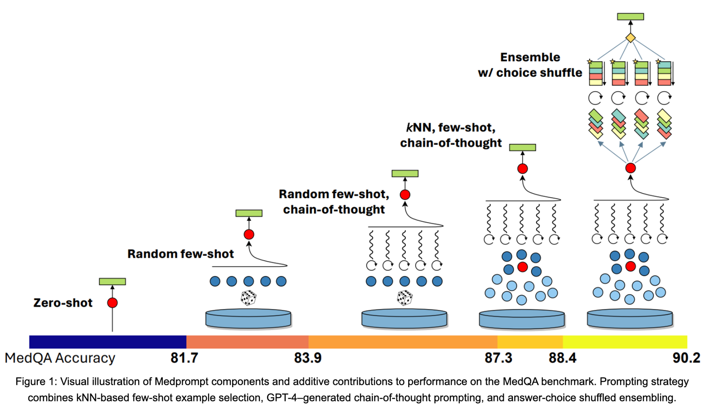
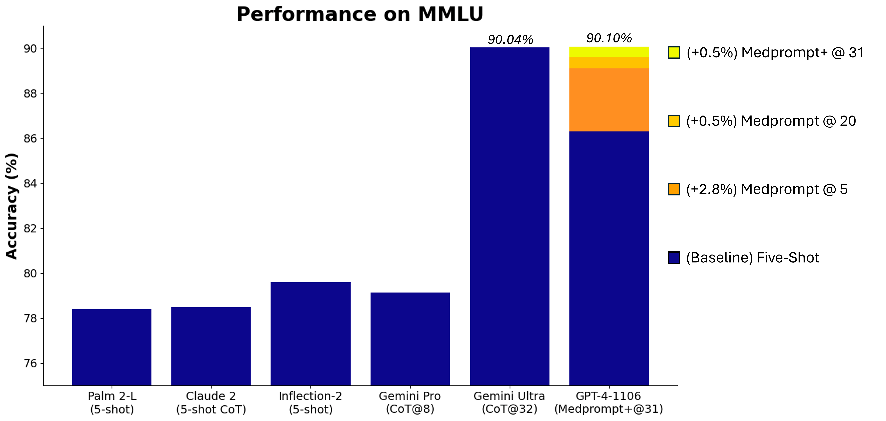

# promptbase

`promptbase` is an evolving collection of resources, best practices, and example scripts for eliciting the best performance from foundation models like `GPT-4`. We currently host scripts demonstrating the [`Medprompt` methodology](https://arxiv.org/abs/2311.16452), including examples of how we further extended this collection of prompting techniques ("`Medprompt+`") into non-medical domains: 

| Benchmark | GPT-4 Prompt | GPT-4 Results | Gemini Ultra Results |
| ---- | ------- | ------- | ---- |
| MMLU | Medprompt+ | 90.10% | 90.04% |
| GSM8K | Zero-shot | 95.3% | 94.4% |
| MATH | Zero-shot | 68.4% | 53.2% |
| HumanEval | Zero-shot | 87.8% | 74.4% |
| BIG-Bench-Hard | Few-shot + CoT | 89.0% | 83.6% |
| DROP | Zero-shot + CoT | 83.7% | 82.4% |
| HellaSwag | 10-shot | 95.3% | 87.8% |


In the near future, `promptbase` will also offer further case studies and structured interviews around the scientific process we take behind prompt engineering. We'll also offer specialized deep dives into specialized tooling that accentuates the prompt engineering process. Stay tuned!

## `Medprompt` and The Power of Prompting

<details>
<summary>
    <em>"Can Generalist Foundation Models Outcompete Special-Purpose Tuning? Case Study in Medicine" (H. Nori, Y. T. Lee, S. Zhang, D. Carignan, R. Edgar, N. Fusi, N. King, J. Larson, Y. Li, W. Liu, R. Luo, S. M. McKinney, R. O. Ness, H. Poon, T. Qin, N. Usuyama, C. White, E. Horvitz 2023)</em>
</summary>
<br/>
<pre>

@article{nori2023can,
  title={Can Generalist Foundation Models Outcompete Special-Purpose Tuning? Case Study in Medicine},
  author={Nori, Harsha and Lee, Yin Tat and Zhang, Sheng and Carignan, Dean and Edgar, Richard and Fusi, Nicolo and King, Nicholas and Larson, Jonathan and Li, Yuanzhi and Liu, Weishung and others},
  journal={arXiv preprint arXiv:2311.16452},
  year={2023}
}
    </pre>
    <a href="https://arxiv.org/pdf/1909.09223.pdf">Paper link</a>
</details>



In a recent [study](https://arxiv.org/abs/2311.16452), we showed how the composition of several prompting strategies into a method that we refer to as `Medprompt` can efficiently steer generalist models like GPT-4 to achieve top performance, even when compared to models specifically finetuned for medicine. `Medprompt` composes three distinct strategies together -- including dynamic few-shot selection, self-generated chain of thought, and choice-shuffle ensembling -- to elicit specialist level performance from GPT-4. We briefly describe these strategies here:



- **Dynamic Few Shots**: Few-shot learning -- providing several examples of the task and response to a foundation model -- enables models quickly adapt to a specific domain and
learn to follow the task format. For simplicity and efficiency, the few-shot examples applied in prompting for a particular task are typically fixed; they are unchanged across test examples. This necessitates that the few-shot examples selected are broadly representative and relevant to a wide distribution of text examples. One approach to meeting these requirements is to have domain experts carefully hand-craft exemplars. Even so, this approach cannot guarantee that the curated, fixed few-shot examples will be appropriately representative of every test example. However, with enough available data, we can select _different_ few-shot examples for different task inputs. We refer to this approach as employing dynamic few-shot examples. The method makes use of a mechanism to identify examples based on their similarity to the case at hand. For Medprompt, we did the following to identify representative few shot examples: Given a test example, we choose k training examples that are semantically similar using a k-NN clustering in the embedding space. Specifically, we first use OpenAI's `text-embedding-ada-002` model to embed candidate exemplars for few-shot learning. Then, for each test question x, we retrieve its nearest k neighbors x1, x2, ..., xk from the training set (according to distance in the embedding space of text-embedding-ada-002). These examples -- the ones most similar in embedding space to the test question -- are ultimately registered in the prompt.

- **Self-Generated Chain of Thought (CoT)**: Chain-of-thought (CoT) uses natural language statements, such as “Let’s think step by step,” to explicitly encourage the model to generate a series of intermediate reasoning steps. The approach has been found to significantly improve the ability of foundation models to perform complex reasoning. Most approaches to chain-of-thought center on the use of experts to manually compose few-shot examples with chains of thought for prompting. Rather than rely on human experts, we pursued
a mechanism to automate the creation of chain-of-thought examples. We found that we could simply ask GPT-4 to generate chain-of-thought for the training examples, with appropriate guardrails for reducing risk of hallucination via incorrect reasoning chains.

- **Majority Vote Ensembling**: [Ensembling](https://en.wikipedia.org/wiki/Ensemble_learning) refers to combining the output of several algorithms together to yield better predictive performance than any individual algorithm. Frontier models like `GPT-4` benefit from ensembling of their own outputs. A simple technique is to have a variety of prompts, or a single prompt with varied `temperature`, and report the most frequent answer amongst the ensemble constituents. For multiple choice questions, we employ a further trick that increases the diversity of the ensemble called `choice-shuffling`, where we shuffle the relative order of the answer choices before generating each reasoning
path. We then select the most consistent answer, i.e., the one that is least sensitive to choice shuffling, which increases the robustness of the answer.

The combination of these three techniques led to breakthrough performance in Medprompt for medical challenge questions. Implementation details of these techniques can be found here: https://github.com/microsoft/promptbase/tree/main/src/promptbase/mmlu

## `Medprompt+` | Extending the power of prompting 

Here we provide some intuitive details on how we extended the `medprompt` prompting framework to elicit even stronger out-of-domain performance on the MMLU (Measuring Massive Multitask Language Understanding) benchmark.  MMLU was established as a test of general knowledge and reasoning powers of large language models.  The complete MMLU benchmark contains tens of thousands of challenge problems of different forms across 57 areas from basic mathematics to United States history, law, computer science, engineering, medicine, and more. 



We found that applying Medprompt without modification to the whole MMLU achieved a score of 89.1%. Not bad for a single policy working across a great diversity of problems!  But could we push Medprompt to do better?  Simply scaling-up MedPrompt can yield further benefits. As a first step, we increased the number of ensembled calls from five to 20.  This boosted performance to 89.56%. 

On working to push further with refinement of Medprompt, we noticed that performance was relatively poor for specific topics of the MMLU. MMLU contains a great diversity of types of questions, depending on the discipline and specific benchmark at hand. How might we push GPT-4 to perform even better on MMLU given the diversity of problems?

We focused on extension to a portfolio approach based on the observation that some topical areas tend to ask questions that would require multiple steps of reasoning and perhaps a scratch pad to keep track of multiple parts of a solution. Other areas seek factual answers that follow more directly from questions. Medprompt employs “chain-of-thought” (CoT) reasoning, resonating with multi-step solving.  We wondered if the sophisticated Medprompt-classic approach might do less well on very simple questions and if the system might do better if a simpler method were used for the factual queries. 

Following this argument, we found that we could boost the performance on MMLU by extending MedPrompt with a simple two-method prompt portfolio. We add to the classic Medprompt a set of 10 simple, direct few-shot prompts soliciting an answer directly without Chain of Thought. We then ask GPT-4 for help with deciding on the best strategy for each topic area and question. As a screening call, for each question we first ask GPT-4:
```
# Question
{{ question }}
 
# Task
Does answering the question above require a scratch-pad?
A. Yes
B. No
```

If GPT-4 thinks the question does require a scratch-pad, then the contribution of the Chain-of-Thought component of the ensemble is doubled. If it doesn't, we halve that contribution (and let the ensemble instead depend more on the direct few-shot prompts). Dynamically leveraging the appropriate prompting technique in the ensemble led to a further +0.5% performance improvement across the MMLU.

We note that Medprompt+ relies on accessing confidence scores (logprobs) from GPT-4. These are not publicly available via the current API but will be enabled for all in the near future.


## Running Scripts

> Note: Some scripts hosted here are published for reference on methodology, but may not be immediately executable against public APIs. We're working hard on making the pipelines easier to run "out of the box" over the next few days, and appreciate your patience in the interim!

First, clone the repo and install the promptbase package:

```bash
cd src
pip install -e .
```

Next, decide which tests you'd like to run. You can choose from:

- bigbench
- drop
- gsm8k
- humaneval
- math
- mmlu

Before running the tests, you will need to download the datasets from the original sources (see below) and place them in the `src/promptbase/datasets` directory.

After downloading datasets and installing the promptbase package, you can run a test with:

`python -m promptbase dataset_name`

For example:

`python -m promptbase gsm8k`

## Dataset Links

To run evaluations, download these datasets and add them to /src/promptbase/datasets/

 - MMLU: https://github.com/hendrycks/test
    - Download the `data.tar` file from the above page
    - Extract the contents
    - Run `mkdir src/promptbase/datasets/mmlu`
    - Run `python ./src/promptbase/format/format_mmlu.py --mmlu_csv_dir /path/to/extracted/csv/files --output_path ./src/promptbase/datasets/mmlu`
    - You will also need to set the following environment variables:
      - `AZURE_OPENAI_API_KEY`
      - `AZURE_OPENAI_CHAT_API_KEY`
      - `AZURE_OPENAI_CHAT_ENDPOINT_URL`
      - `AZURE_OPENAI_EMBEDDINGS_URL`
 - HumanEval: https://huggingface.co/datasets/openai_humaneval
 - DROP: https://allenai.org/data/drop
 - GSM8K: https://github.com/openai/grade-school-math
 - MATH: https://huggingface.co/datasets/hendrycks/competition_math
 - Big-Bench-Hard: https://github.com/suzgunmirac/BIG-Bench-Hard
   The contents of this repo need to be put into a directory called `BigBench` in the `datasets` directory

## Other Resources:

Medprompt Blog: https://www.microsoft.com/en-us/research/blog/the-power-of-prompting/

Medprompt Research Paper: https://arxiv.org/abs/2311.16452

Medprompt+: https://www.microsoft.com/en-us/research/blog/steering-at-the-frontier-extending-the-power-of-prompting/

Microsoft Introduction to Prompt Engineering: https://learn.microsoft.com/en-us/azure/ai-services/openai/concepts/prompt-engineering

Microsoft Advanced Prompt Engineering Guide: https://learn.microsoft.com/en-us/azure/ai-services/openai/concepts/advanced-prompt-engineering?pivots=programming-language-chat-completions


